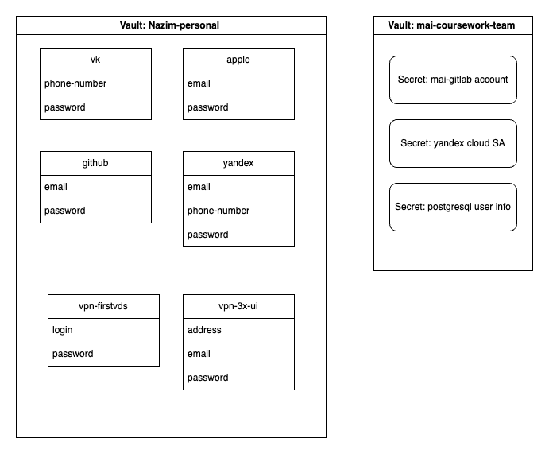
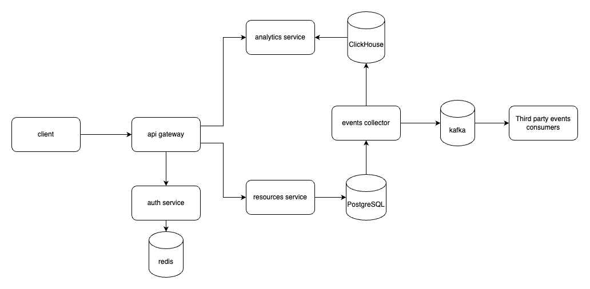
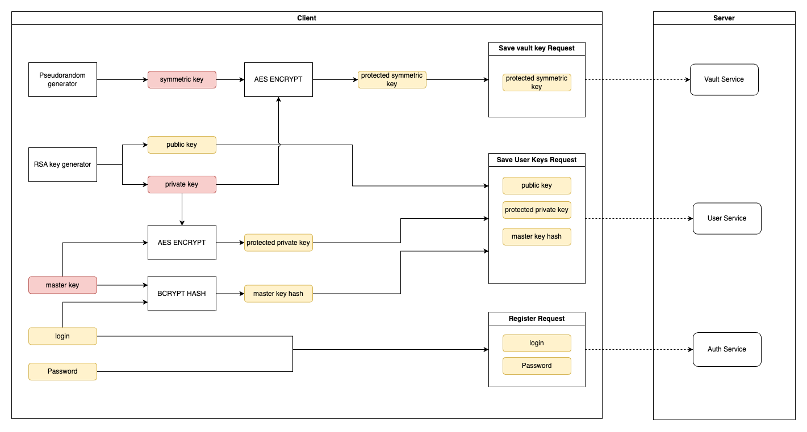

## Введение

ZeroLarec - Сервис для безопасного управления секретами. Безопасность достигается с помощью следующих факторов:

- **Централизованное управление секретами.** Хранение секретов в одном защищенном сервиса, позволяет уменьшить вектор атаки со стороны злоумышленника.
- **Совместный доступ с гранулярной настройкой.** Для контроля доступа используется ролевая модель доступа (Role Based Access Control).
- **Полная наблюдаемость жизненного цикла.** Каждое действие пользователя записывается в событие информационной безопасности, которое хранится на сервере и по желанию пользоватя может быть отправлено в системы класса SIEM.
- ***Сквозное шифрование.** Шифрование и дешифрование секретов происходит на стороне клиента - у сервера есть доступ только к зашифрованным данным без возможности их расшифровать. Таким образом, даже в случае компрометации сервера злоумышленник не сможет получить доступ к данным пользователя.

## Ресурсная модель

ZeroLarec оперирует следующими ресурсами:
- **Хранилище** - Корневой ресурс. Для каждого хранилища создается отдельный ключ доступа к секретам.
- **Секрет** - Непосредственный секрет, в котором пользователь хранит защищенные данные. Каждый секрет хранится в одном из хранилищ.

### Пример

Рассмотрим пример ресурсов. Создано 2 хранилища:
- Nazim-personal - персональное хранилище для пользователя Nazim. В нем хранятся следующие секреты:
    - vk - информация о личном аккаунте в социальной сети VK.
    - apple - информация о личном аккаунте в Apple.
    - github - личный аккаунт в GitHub.
    - github - личный аккаунт в Yandex.
    - vpn-firstvds - информация об аккаунте в сервисе FirstVDS для хостинга личного VPN.
    - vpn-3x-ui - информация об аккаунте vpn сервисе 3x-ui.
- mai-coursework-team - Хранилище для управления секретами в рамках выполнения курсовой работы в комнде. 

## Ролевая модель

| Роль | Vault | Secret |
|----------|----------|----------|
| Guest    | доступ на просматр основной информации о хранилище. Роль по умолчанию для всех приглашенных пользователей. | -   |
| Viewer    | Доступ на чтение всех секретов в хранилище | Доступ на чтение секрета |
| Editor    | Доступ на изменение информации о хранилище   | Доступ на изменение секрета   |
| Admin    | Доступ на изменение прав доступа к хранилищу   | Доступ на изменение прав доступа к секрету |

Роли наследуются от хранилища к секретам.

## Архитектура

Архитектура ZeroLarec выглядит следующим образом:

Список используемых компонентов:
1. Client - клиентское приложение, на стороне которого происходит шифрование и дешифрование секретов.
2. Api Gateway - сервис, который является для клиента точкой входа, предоставляет ему API.
3. Auth Service - сервис, который занимается аутентификацией запросов со стороны клиента. Токены пользователей он хранит в Redis.
4. Resource service - сервис, которный непосредственно управляет жизненным циклам ресурсов. Информацию о событиях он хранит в PostgreSQL. В каждой транзакции для операции над ресурсами он дополнительно создает в событие и сохраняет его в эту же базу данных для обеспечения гарантии At least once.
5. Events collector - сервис, который батчами забирает события из PostgreSQL, отправляет их в Kafka для отправления во внешние системы и в ClickHouse для аналитики.
6. Third party events consumers - внешние системы, в которые пользователь может настоить отлив событий.
7. Analytics Service - сервис, предоставляющий интерфейс для аналитики по событиям.

## Реализация сквозного шифрования

### Вход в систему

Алгоритм входа в систему выглядит следующим образом:

1.  На основе логина и мастер-пароля создается мастер-ключ. Он используется для шифрования и дешифрования данных и хранится только на стороне клиента.
2. На основе мастер-пароля и мастер-ключа создается ключ для аутентификации. Он передается в сервис аутентификации.
3. Генерируется пара RSA ключей. Они используются для шифрования и дешифрования ключей хранилищ. Приватный ключ шифруется с помощью мастер-ключа и передается на сервер, а открытый передается на сервер без шифрования. Таким образом чтобы пользователю A пригласить в хранилище пользователя B, он должен зашифровать ключ хранилища открытым RSA ключем пользователя B.
4. Создается персональное хранилище пользователя. Для этого псевдослучайный генератор создает ключ хранилища, который используется для шифрования и дешифрования секретов в нем. Ключ хранилища публичным ключем пользователя и отправляется на сервер.

Никакие секретные данные хранятся только на клиенте, а на сервер если и попадают, то только в зашифрованном виде. Таким образом даже сервер будет скомпрометирован, злоумышленник не сможет получить доступ к секретам пользователя. 