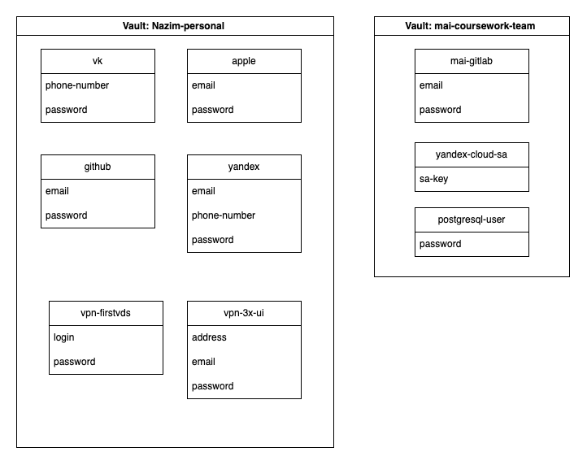
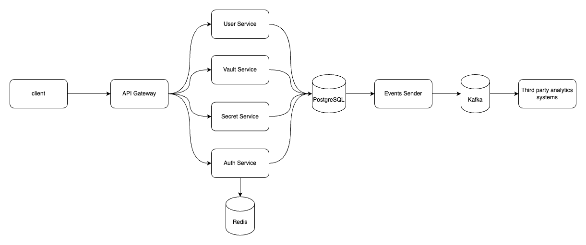

## Введение

ZeroLarec - Сервис для безопасного управления секретами. Безопасность достигается с помощью следующих факторов:

- **Централизованное управление секретами.** Хранение секретов в одном защищенном сервисе позволяет уменьшить вектор атаки со стороны злоумышленника.
- **Совместный доступ с гранулярной настройкой.** Для контроля доступа используется ролевая модель доступа (Role Based Access Control).
- **Полная наблюдаемость жизненного цикла.** Каждое действие пользователя записывается в событие информационной безопасности, которое хранится на сервере и по желанию пользоватя может быть отправлено в системы класса SIEM.
- **Сквозное шифрование.** Шифрование и дешифрование секретов происходит на стороне клиента - у сервера есть доступ только к зашифрованным данным без возможности их расшифровать. Таким образом, даже в случае компрометации сервера злоумышленник не сможет получить доступ к данным пользователя.

## Ресурсная модель

ZeroLarec оперирует следующими ресурсами:
- **Хранилище** - Корневой ресурс. Для каждого хранилища создается отдельный ключ доступа к секретам.
- **Секрет** - Непосредственный секрет, в котором пользователь хранит защищенные данные. Каждый секрет хранится в одном из хранилищ и наследуе из него права доступа. 

### Пример

Рассмотрим пример ресурсов. Создано 2 хранилища:
- Nazim-personal - персональное хранилище для пользователя Nazim. В нем хранятся следующие секреты:
    - vk - информация о личном аккаунте в социальной сети VK.
    - apple - информация о личном аккаунте в Apple.
    - github - личный аккаунт в GitHub.
    - github - личный аккаунт в Yandex.
    - vpn-firstvds - информация об аккаунте в сервисе FirstVDS для хостинга личного VPN.
    - vpn-3x-ui - информация об аккаунте vpn сервисе 3x-ui.
- mai-coursework-team - Хранилище для управления секретами в рамках выполнения курсовой работы в команде. 
    - mai-gitlab - информация об аккаунте команды в университетском gitlab.
    - yandex-cloud-sa - информация о данных в Яндекс Облаке, в котором развернута инфраструктура для курсовой работы.
    - postgresql-user - информация о данных для подключения к субд, используемой в курсовом проекте.
## Контроль доступа

В качестве модели контроля доступа выбрана модель [RBAC](https://ru.wikipedia.org/wiki/Управление_доступом_на_основе_ролей).

### Субьекты

Субьект (subject) - лицо, соверщающее операции над ресурсами. Субьектом является пользователь.

### Ресурсы
Ресурс (resource) - сущность, над которым субьект совершает операции. Ресурсами являются *Хранилище* и *Секрет*.

### Пермиссии

Пермиссия (permission) - атомарное действие над ресурсом. Доступны следующие пермиссии:

| Название | Описание |
|----------|----------|
| `secret.get` | Прочитать информацию о секрете |
| `secret.update` | Изменить данные секрет|
| `secret.delete` | Удалить секрет|
| `secret.grant_access` | Настроить доступ к секрету для других пользователей |
| `vault.get` | Прочитать информацию о хранилище |
| `vault.list_members` | Получить список участников хранилища |
| `vault.update` | Изменить данные хранилища |
| `vault.delete` | Удалить хранилище |
| `vault.add_user` | Добавить пользователя в хранилище |
| `vault.remove_user` | Удалить пользователя из хранилища |
| `vault.grant_access` | Настроить доступ к хранилищу для других пользователей |

### Роли

Роль  (role) - множество пермиссий. Доступны следующие роли:

| Название | Описание | Список пермиссий |
|----------|----------|------------------|
| `member` | Участник хранилища. Данная роль выдается по умолчанию всем пользователям приглашенным в хранилище. | `vault.get`,    `vault.list_members` |
| `viewer` | Читатель. Может читать данные хранилища и секретов, но не может их изменять. | Все пермиссии, включенные в роль `member`,    `secret.get` |
| `editor` | Писатель. Может читать и изменять данные хранилища и секретов. | Все пермиссии, включенные в роль `viewer`,    `vault.update`,    `vault.update`,    `vault.delete`,    `secret.update`,    `secret.delete` |
| `admn` | Администратор. Может читать, изменять данные хранилища и секретов, а также управлять доступом остальных пользователей. Данная роль выдается по умолчанию создателю хранилиав. | Все пермиссии, включенные в роль `editor`,    `vault.add_user`,    `vault.remove_user`,    `vault.grant_access`,    `secret.grant_access`|

### Привязки ролей

Привязка ролей (role binding) - правило вида **Дать субьекту *X* роль *Y* на ресурс *Z***. Именно с помощью привязок ролей пользователями контролируют доступ субьектов к ресурсам.

## Архитектура

Архитектура ZeroLarec выглядит следующим образом:

Список используемых компонентов:
1. **Client** - клиентское приложение, на стороне которого происходит шифрование и дешифрование секретов.
2. **Api Gateway** - сервис, который является для клиента точкой входа, предоставляет ему API.
3. **Auth Service** - сервис, который отвечает за аутентификацию и авторизацию пользователей. Роли пользователей он хранит в PostgreSQL, а токены пользователей в Redis.
4. **User Service** - сервис, который управляет жизненным циклам пользовователей. Данные о пользователях он хранит в PostgreSQL.
5. **Vault Service** - сервис, который управ
6. В каждой транзакции для операции над ресурсами сервисы дополнительно создают в событие и сохраняют его в PostgreSQL для обеспечения гарантии At least once.
5. **Events Sender** - сервис, который батчами забирает события из PostgreSQL, отправляет их в Kafka для отправления во внешние аналитические системы.
6. **Third party analytics systems** - внешние аналитические системы.

## Реализация сквозного шифрования

Сквозное шифрование реализовано следующим образом:

1. Пользователь передает логин и пароль на Auth Service - они используются для аутентификации.
2. После аутентификации пользователь создает мастер ключ для шифрования данных - он хешируется и передается на сервер для последующей проверки целостности.
3. Генерируется пара RSA ключей. Они используются для шифрования и дешифрования ключей хранилищ. Приватный ключ шифруется с помощью мастер-ключа и передается на сервер, а открытый передается на сервер без шифрования. Таким образом чтобы пользователю A пригласить в хранилище пользователя B, он должен зашифровать ключ хранилища открытым RSA ключем пользователя B.
4. Создается персональное хранилище пользователя. Для этого псевдослучайный генератор создает ключ хранилища, который используется для шифрования и дешифрования секретов в нем. Ключ хранилища публичным ключем пользователя и отправляется на сервер.

Все секретные данные в открытом виде хранятся только на клиенте - на сервер попадают зашифрованными. Таким образом даже сервер будет скомпрометирован, злоумышленник не сможет получить доступ к секретам пользователя. 